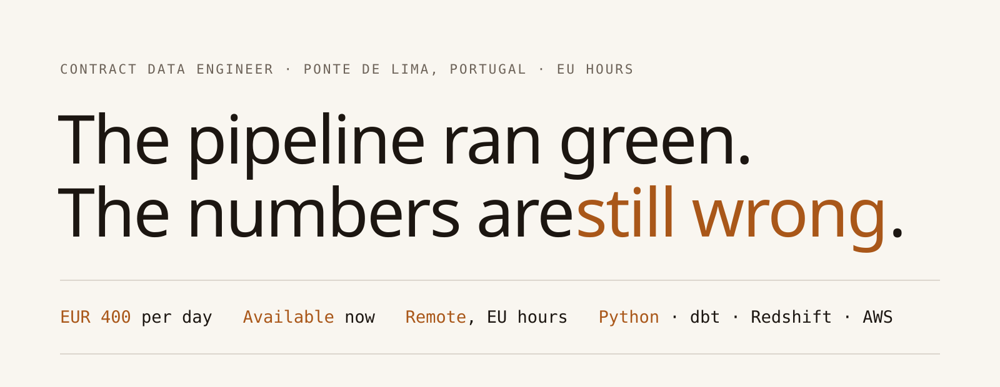
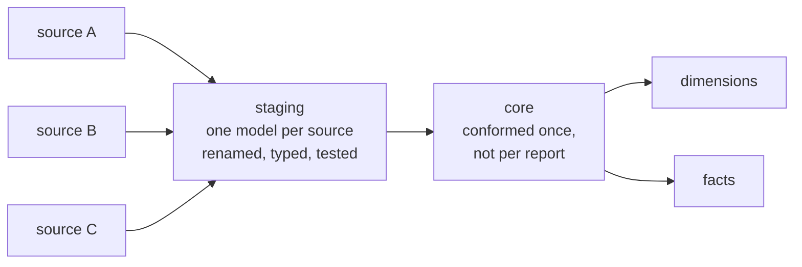

<picture>
  <source media="(prefers-color-scheme: dark)" srcset="assets/header-dark.svg">
  
</picture>

I build the staging layer, the tests and the job triggers that make a warehouse trustworthy. Most recently 34 dbt models across two markets. Before that, a livestock genomics data system.

**[jamesphillipsanders.com](https://jamesphillipsanders.com)** &nbsp;·&nbsp; [hello@jamesphillipsanders.com](mailto:hello@jamesphillipsanders.com) &nbsp;·&nbsp; [LinkedIn](https://www.linkedin.com/in/jmspsndrs)

### Evidence

| | |
|:--|:--|
| **34** dbt models, two markets | The staging layer of an analytics warehouse for a retail business operating in two countries, then the dimensional models on top of it. I brought the second market into the core models and reconciled category ids across two countries that named things differently. 83 commits, Aug 2025 to Dec 2025 · 24 staging, 3 dimension, 1 fact · dbt, Redshift, Step Functions, Python, SQLFluff |
| **573** commits on a genotype data system | A livestock genomics system. Illumina IDAT files land, get linked to metadata, are checked for authorisation, loaded as genotypes, then checked for discordance against other samples from the same animal. I built the sample QA framework and added the discordance trigger. 20 repositories, Apr 2023 to Nov 2024 · 31% of the task dispatcher, 29% of the discordance analyser · Python, AWS Lambda, SQS, Snowflake, Terraform |

Both are private client codebases. Every number comes from their commit history.

### Four failures I have found and fixed

**The fact table joins on a null.** Every test passes. Then a surrogate key comes through empty, the join silently drops rows, and the revenue number is quietly short. I fix the key in staging and add the test that would have caught it.

**A rerun duplicates instead of repairing.** An incremental model without a reliable unique key doubles when you run it again. I fix the key strategy so a rerun is safe.

**Text arrives as mojibake.** An encoding mismatch turns apostrophes into noise that reaches a customer facing report weeks later. I fix it at the boundary where it breaks, not in the presentation layer.

**A dead source keeps building.** A system is switched off and its models keep running against a table that stopped updating. I cut the dead lineage out.

### How I lay out a warehouse

Nothing downstream reads a raw table, so there is exactly one place to fix any given defect.

### What I do not do

No production machine learning. No streaming: I have not run Kafka, Kinesis or Flink. AWS and Cloudflare only, no production Azure or GCP. No Kubernetes cluster operations. No enterprise data governance programmes.

### Before software

Seventeen years in professional kitchens, apprentice to head chef, then a Computer Science degree with a Data Science major, earned while still working full time on the line. A kitchen teaches you that preparation is most of the job, that the handover to the next shift is not optional, and that nothing broken leaves the pass.
